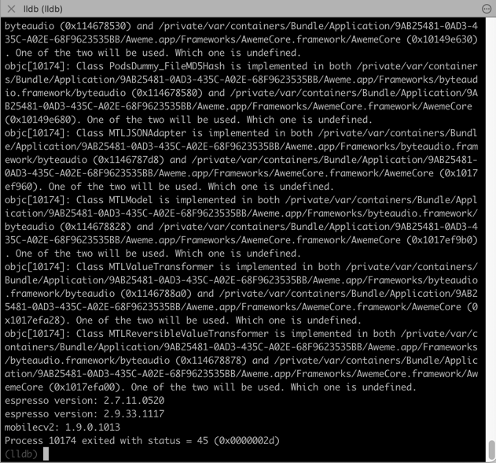
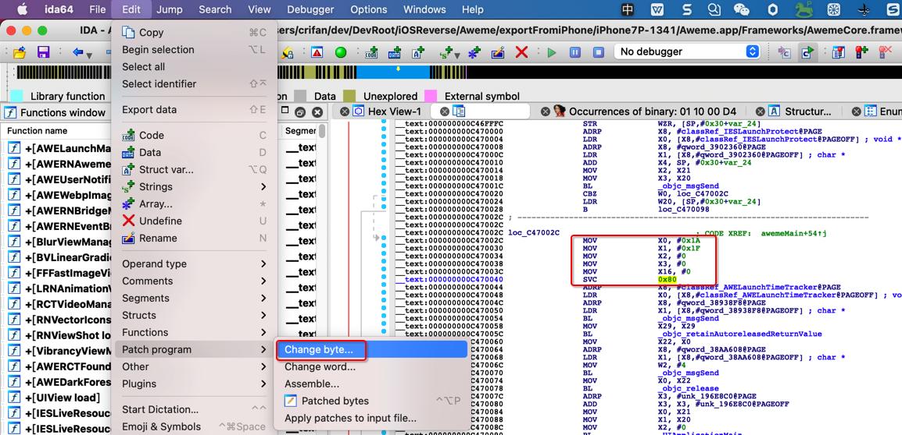
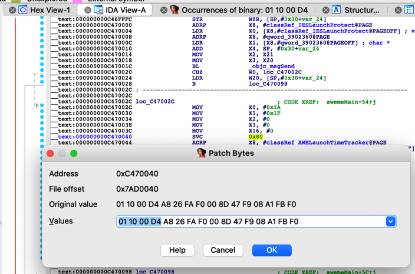
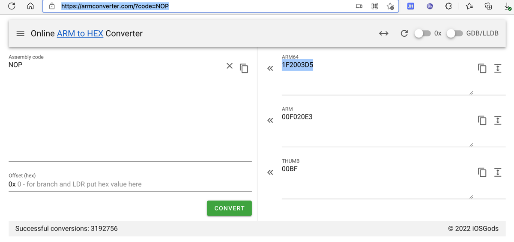
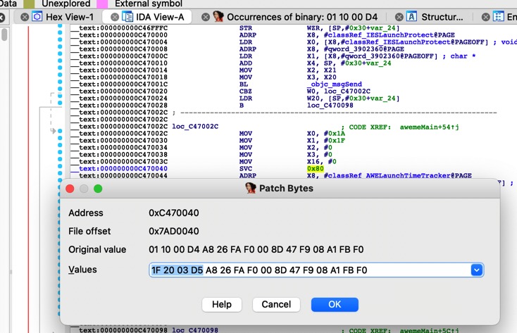
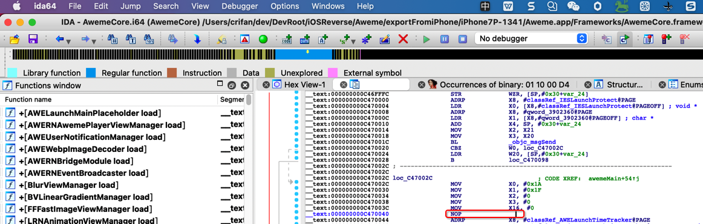
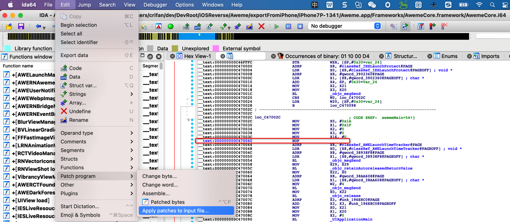
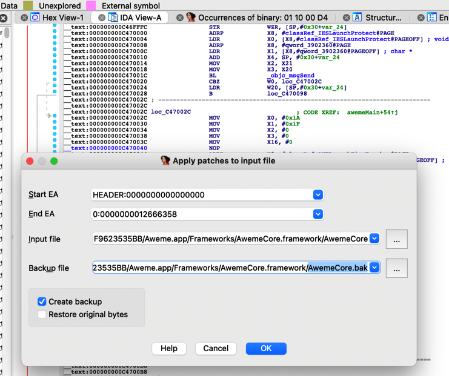
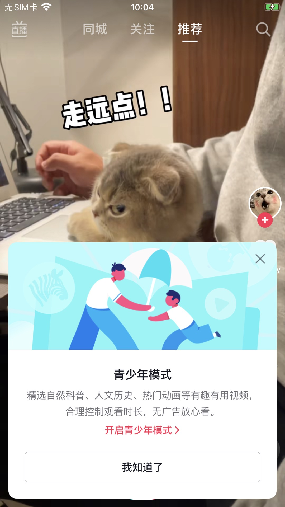

# 反调试和反反调试举例：抖音

此处以`抖音`为例，介绍，反调试和反反调试的具体过程：

### 先去研究清楚，具体对方用了什么反调试手段

Mac中用lldb去调试iPhone中的iOS的app抖音，结果报错：

```bash
...
espresso version: 2.7.11.0520
espresso version: 2.9.33.1117
mobilecv2: 1.9.0.1013
Process 10174 exited with status = 45 (0x0000002d)
```



研究后找到定义：

* `/System/Library/Frameworks/Kernel.framework/Versions/A/Headers/sys/errno.h`
* [errno.h (apple.com)](https://opensource.apple.com/source/xnu/xnu-792/bsd/sys/errno.h.auto.html)

```c
#define ENOTSUP  45              /* Operation not supported */
```

-》

* 45 = ENOTSUP =  Operation not supported
  * 意思是：lldb调试的操作，不被允许
  * 原因：app内部做了反调试
    * 那就意味着是`ptrace`的`PT_DENY_ATTACH`的事情了

而实现`ptrace`的`PT_DENY_ATTACH`，之前已知有4种方式：

* `ptrace`
  ```c
  ptrace(PT_DENY_ATTACH, 0, 0, 0);
  ```
* `syscall()` = `syscall` + `ptrace` + `PT_DENY_ATTACH`
  ```c
  syscall(SYS_ptrace, PT_DENY_ATTACH, 0, NULL, 0);
  ```
* `sysctl` ?
* `svc 0x80` + `syscall` + `ptrace` = `inline asm`=`ARM汇编`
  ```asm
  mov x0, #26 // ptrace
  mov x1, #31 // PT_DENY_ATTACH
  mov x2, #0
  mov x3, #0
  mov x16, #0
  svc #0x80
  ```

继续后续调试，找到代码：

```asm
__text:000000000C47002C loc_C47002C                             ; CODE XREF: _awemeMain+54↑j
__text:000000000C47002C                 MOV             X0, #0x1A
__text:000000000C470030                 MOV             X1, #0x1F
__text:000000000C470034                 MOV             X2, #0
__text:000000000C470038                 MOV             X3, #0
__text:000000000C47003C                 MOV             X16, #0
__text:000000000C470040                 SVC             0x80
```


至此，清楚了：

* 抖音的反调试手段
  * `svc 0x80`的`内联汇编`实现的`syscall`的`ptrace`的`PT_DENY_ATTACH`

## 再去针对性的处理=反反调试

此处，针对：

* 抖音的反调试手段
  * `svc 0x80`的`内联汇编`实现的`syscall`的`ptrace`的`PT_DENY_ATTACH`

去实现：

* 反反调试的抖音的手段
  * 把内联的ARM汇编的`svc 0x80`指令替换成`NOP`指令=空指令

具体操作：

* 前提：已找到`svc 0x80`的ARM汇编指令的位置了
  * 如果有多处，也要全部都找到
* 思路：借助于IDA实现指令替换，把`svc 0x80`相关指令，替换成NOP指令
* 步骤：

`IDA Pro`->鼠标停留=选中对应的要修改的汇编代码（所在的行）->`Edit`->`Patch Program`->`Change byte`:



会出现：

* ARM汇编指令：
  * `svc 0x80`对应的二进制=bytecode=字节码：`01 10 00 D4`



此处借助于：

* [Online ARM to HEX Converter (armconverter.com)](https://armconverter.com/?code=NOP)

去搞清楚：

要替换成的：

* NOP指令
  * （ARM的`ARM64`的，此处的端是：`Little Endian`）
    * 对应的字节码=bytecode：`1F 20 03 D5`
      * 

即，把：`01 10 00 D4`改为`1F 20 03 D5`



点击`OK`，即可修改成功：



再去保存，保存到原输入文件：



此处，为了更好保留原文件，点击勾选：`Create backup`



会自动生成 xxx.bak

* `Aweme.app/Frameworks/AwemeCore.framework/AwemeCore`
  * 
* `Aweme.app/Frameworks/AwemeCore.framework/AwemeCore.bak`

确认文件的确已变化：

```bash
➜  AwemeCore.framework pwd
/Users/crifan/dev/DevRoot/iOSReverse/Aweme/exportFromiPhone/iPhone7P-1341/Aweme.app/Frameworks/AwemeCore.framework
➜  AwemeCore.framework ls -l
total 18632888
-rw-r--r--  1 crifan  staff   240666608  1  8 09:43 AwemeCore
-rw-r--r--  1 crifan  staff   240666608  1  5 15:00 AwemeCore.backup
-rw-r--r--  1 crifan  staff   240666608  1  8 09:43 AwemeCore.bak
...
```

->

* `AwemeCore`
  * `240666608`
* `AwemeCore.bak`
  * `240666608`

-》文件大小没变，最后改动时间变了。

另外，再去：拷贝到iPhone7中，重新调试。

最终效果：

去掉反调试后，可以正常用[debugserver+lldb](https://book.crifan.org/books/ios_re_debug_debugserver_lldb/website/)去调试启动抖音了：


