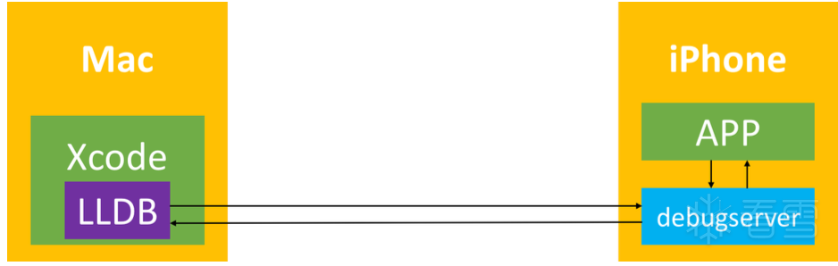
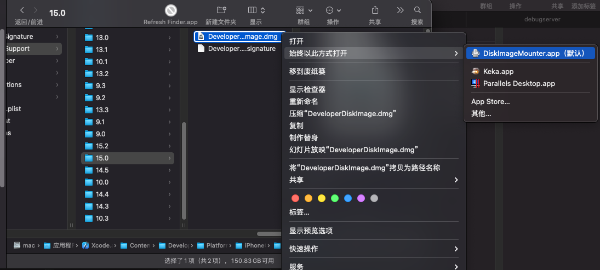

# lldb+debugserver

iOS逆向时，调试代码逻辑的常用调试工具之一是：命令行的`lldb + debugserver`

## 背景介绍

此处用于iOS逆向调试的`lldb + debugserver`：

* 主要指的是
  * `iPhone`中的`Server`端：**debugserver**=`lldb server`
  * `Mac`中的`Client`端：**lldb**=`lldb client`
* 基本架构
  * 

### debugserver

* `debugserver`
  * 是什么：一个终端的应用
    * 也是：`XCode`去调试iOS设备中程序时候的进程名
  * 在哪里：iOS设备中
    * 位置：`/Developer/usr/bin/debugserver`
    * 注：iOS中默认没安装debugserver
      * iOS何时安装了`debugserver`
        * 在设备连接过一次`Xcode`，并在`Window`->`Devices`中添加此设备后
          * `debugserver`才会被`Xcode`安装到`iOS`的`/Developer/usr/bin/`下
  * 作用：作为服务端，接受来自远端的`gdb`或`lldb`的调试
    * 可以理解为：`lldb`的`server`
  * 为何需要
    * iOS中，由于App运行检测到越狱后会直接退出，所以需要通过`debugserver`来启动程序
  * 通过`debugserver`来启动程序
    * 举例
      * `debugserver -x backboard 0.0.0.0:1234 ./*`
      * `debugserver *:1234 -a "MoneyPlatListedVersion"`

从技术上，应属于：LLDB的远程调试，需要用到：`lldb-server`

### lldb-server

* lldb-server 远程调试
  * 分2个端
    * `lldb client`
      * 运行在 local system
        * 比如`Linux`、`Mac`
    * `lldb server`
      * 不同平台
        * `Linux`和`Android`：`lldb-server`
          * 不依赖于`lldb`
            * 因为：已静态链接包含了`LLDB`的核心功能
            * 对比：`lldb`是默认是动态链接`liblldb.so`
        * `Mac`和`iOS`：`debugserver`
      * 运行在 remote system
      * 实现了remote-gdb的功能
    * 两者通讯
      * 用的是：`gdb-remote`协议
        * 一般是在TCP/IP之上运行
  * 细节详见：
    * `docs/lldb-gdb-remote.txt`
  * 资料
    * 主页
      * Remote Debugging — The LLDB Debugger
        * http://lldb.llvm.org/use/remote.html

## 用lldb+debugserver调试iOS程序

此处之前在iPhone8中跑通的流程，可以用debugserver+lldb去调试启动抖音app的过程是：

核心思路是：

* `iPhone`中：确保`debugserver`有正确的权限entitlement
  * 先从`iPhone`中导出`debugserver`
  * 再去`Mac`中，（用`ldid`或`codesign`）给`debugserver`加上合适的权限
  * 再把加了`entitlement`的`debugserver`拷贝回`iPhone`中
* `iPhone`中：用`debugserver`启动(抖音)app
* `Mac中`：用`lldb`去调试(抖音)app

详细过程是：

### 确保iPhone中debugserver有正确的权限

#### Mac中：从iPhone中导出debugserver

* 前提
  * 已实现ssh免密登录，所以可以直接用scp去拷贝

```bash
scp root@192.168.0.58:/Developer/usr/bin/debugserver .
```

* 参数说明
  * `root`：`ssh`的用户名
  * `192.168.0.58`：iPhone的IP
  * `/Developer/usr/bin/debugserver`：`iPhone`中的`debugserver`的所在目录，原始的`debugserver`
  * `.`：当前文件夹

#### Mac中：给debugserver加上合适的权限

关于加上合适权限，很多人，其他人，都是说的思路是：

* **多步**：先导出权限，再编辑，最后加上

但是后来确认，直接：

* **一步** = 直接写入合适的权限

即可。

具体步骤：

##### 准备好entitlement文件

把下面内容保存为：`debugserver.entitlements`

```xml
<?xml version="1.0" encoding="UTF-8"?>
<!DOCTYPE plist PUBLIC "-//Apple//DTD PLIST 1.0//EN" "http://www.apple.com/DTDs/PropertyList-1.0.dtd">
<plist version="1.0">
<dict>
    <key>com.apple.springboard.debugapplications</key>
    <true/>
    <key>com.apple.backboardd.launchapplications</key>
    <true/>
    <key>com.apple.backboardd.debugapplications</key>
    <true/>
    <key>com.apple.frontboard.launchapplications</key>
    <true/>
    <key>com.apple.frontboard.debugapplications</key>
    <true/>
    <key>com.apple.private.logging.diagnostic</key>
    <true/>
    <key>com.apple.private.memorystatus</key>
    <true/>
    <key>com.apple.private.cs.debugger</key>
    <true/>
    <key>get-task-allow</key>
    <true/>
    <key>task_for_pid-allow</key>
    <true/>
    <key>run-unsigned-code</key>
    <true/>
</dict>
</plist>
```

说明：

* 已加上权限：`get-task-allow`、`task_for_pid-allow`、`run-unsigned-code`
  * 目的：允许debugserver调试其他app
* 已去掉权限：`com.apple.security.network.server`、`com.apple.security.network.client`
  * 目的：防止后续lldb调试报错`Failed to get connection from a remote gdb process`
    * 详见：【已解决】debugserver调试iOS抖音报错：Failed to get connection from a remote gdb process
* 已去掉权限：`seatbelt-profiles`
  * 目的：方式后续`debugserver`加上`-l`的日志文件时报错：`Failed to open log file for writing  errno = 1 Operation not permitted`
    * 详见：【已解决】debugserver带日志运行报错：Failed to open log file for writing errno 1 Operation not permitted

##### 把entitlement权限加到debugserver中

* 方式1：用ldid
  ```bash
  ldid -Sdebugserver.entitlements debugserver
  ```
  * 说明
    * `-S`和`参数`，即权限文件（`debugserver.entitlements`），之间**没有**空格
* 方式2：用`codesign`
  ```bash
  codesign -f -s - --entitlements debugserver.entitlements debugserver
  ```
  * 等价于=简写为
    * `codesign -fs- --entitlements debugserver.entitlements debugserver`

#### Mac中：把加了`entitlement`的`debugserver`拷贝回`iPhone`中

```bash
scp debugserver root@192.168.0.58:/usr/bin
```

说明：

* 为何没有拷贝回/覆盖原先的`/Developer/usr/bin/debugserver`？
  * 因为`/Developer`是`ramdisk`挂载的，是`readonly`=`只读`的，无法写入
* 为何选择路径`/usr/bin`？
  * 用于存放可执行文件工具的路径，`/usr/bin`是常见之一，比较适合此处用途
    * 其他目录，理论上也可以：
      * `/bin`
      * `/sbin`
      * `/usr/sbin`
      * 等
  * 注意：确保iPhone中的`PATH`环境变量包含此处所用路径即可
    * 目的：便于后续其他任何位置都能找的到和能直接调用`debugserver`
    * 如何查看当前环境变量值：`echo $PATH`
      * 举例
        ```bash
        # echo $PATH
        /usr/local/sbin:/usr/local/bin:/usr/sbin:/usr/bin:/sbin:/bin:/usr/bin/X11:/usr/games
        ```

### iPhone中：用debugserver启动(抖音)app

概述：

* Attach模式：先手动启动app，再去用`debugserver`挂载`attach`
  * `-a`加上`PID`或`app名`
    * `PID`=进程ID
      ```bash
      debugserver 0.0.0.0:20221 -a 10194
      ```
    * app名
      ```bash
      debugserver 0.0.0.0:20221 -a "Aweme"
      debugserver 0.0.0.0:1234 -a "YouTube"
      ```
  * 其他额外参数
    * 加日志`log`
      ```bash
      debugserver -l debug.log 0.0.0.0:20221 -a 10194
      ```
    * 加详情`verbose`
      ```bash
      debugserver -v 0.0.0.0:20221 -a 10194
      ```
    * 开启调试`debugging`
      ```bash
      debugserver -g 0.0.0.0:20221 -a 10194
      ```
* Spaw模式：直接用debugserver启动app
  ```bash
  debugserver -x auto 0.0.0.0:20221 /private/var/xxx/Aweme.app/Aweme
  ```
  * 注：此处app的二进制的完整路径，有多种方式可以得到
    * 方式1：通过爱思助手查看已安装的app的相关路径
    * 方式2：通过前面的Attach模式调试期间通过`image list -o -f`查看得到
      * 举例
        * WhatsApp的路径：`/private/var/containers/Bundle/Application/CCFD22D2-32EE-4F23-9C81-226663100D40/WhatsApp.app/WhatsApp`
          * Attach模式调试时可查看到
            ```bash
            (lldb) image list -o -f
            [  0] 0x0000000004c6c000 /private/var/containers/Bundle/Application/CCFD22D2-32EE-4F23-9C81-226663100D40/WhatsApp.app/WhatsApp(0x0000000104c6c000)
            ...
            ```

* 说明
  * `0.0.0.0`：比较好理解，表示：允许（来自外部的）任意IP访问
    * 此处指的是：允许电脑端（Mac）中的lldb来访问
  * `20221`：端口号
    * 可以设置任意值，只要不和其他端口号冲突即可
  * 如果遇到反调试而启动失败，则需要去处理反反调试
    * 详见：【已解决】用debugserver启动iPhone中抖音app

### Mac中：用lldb去调试(抖音)app

概述：

```bash
lldb

process connect connect://192.168.0.58:20221
```

参数说明：

* `192.168.0.58`：是`iPhone`的`IP`地址
* `20221`：是之前`debugserver`启动时设置的端口号

注：

此时，iPhone的debugserver会输出：

`Got a connection, launched process /private/var/containers/Bundle/Application/9AB25481-0AD3-435C-A02E-68F9623535BB/Aweme.app/Aweme (pid = 10211).`

然后Mac中即可愉快的正常的调试了：

```bash
(lldb) b ptrace
Breakpoint 1: no locations (pending).
WARNING:  Unable to resolve breakpoint to any actual locations.
(lldb) c
Process 10174 resuming
1 location added to breakpoint 1
...
```

## 附录

### 原始的debugserver的位置

* 原始的Xcode中的debugserver的位置是：`DeveloperDiskImage.dmg`中的`/usr/bin/debugserver`
  * 而Xcode中的`DeveloperDiskImage.dmg`的位置
    * 举例：`iOS 15.0`
      * `/Applications/Xcode.app/Contents/Developer/Platforms/iPhoneOS.platform/DeviceSupport/15.0/DeveloperDiskImage.dmg`
        * 
  * 自己可以通过（双击而自动挂载）打开`DeveloperDiskImage.dmg`，查看到其中的`/usr/bin/debugserver`
    * 

### debugserver的help语法

* help

```bash
iPhone11-151:~ root# /Developer/usr/bin/debugserver --help
debugserver: unrecognized option `--help'
debugserver-@(#)PROGRAM:LLDB  PROJECT:lldb-1300.2.10
 for arm64.
Usage:
  debugserver host:port [program-name program-arg1 program-arg2 ...]
  debugserver /path/file [program-name program-arg1 program-arg2 ...]
  debugserver host:port --attach=<pid>
  debugserver /path/file --attach=<pid>
  debugserver host:port --attach=<process_name>
  debugserver /path/file --attach=<process_name>
```

* 语法详解

```bash
debugserver [<options>] host:<port> [<prog-name> <arg1> <arg2> ...]
```

参数含义：

* `-a process`
  * Attach debugserver to process. The process can be a pid or executable name
* `-d integer`
  * Assign the waitfor-duration
* `-f ?`
  * ?
* `-g`
  * Turn on debugging
* `-i integer`
  * Assign the waitfor-interval
* `-l filename`
  * Log to file. Set filename to stdout to log to standard output
* `-t`
  * Use task ID instead of process ID
* `-v`
  * Verbose
* `-w` ?
  * ?
* `-x method` `--launch=method`
  * How to launch the program. Can be one of:
    * `auto`: Auto-detect the best launch method to use.
    * `fork`: Launch program using fork(2) and exec(3).
    * `posix`: Launch program using posix_spawn(2).
    * `backboard`: Launch program via BackBoard Services.
      * The backboard option is only available in the closed-source version included in Xcode
* `--lockdown`
  * Obtain parameters from lockdown (?)

### ldid的help语法

* Mac中的（用brew安装的）ldid
  ```bash
   /usr/local/bin/ldid --version
  usage: /usr/local/bin/ldid -S[entitlements.xml] <binary>
    /usr/local/bin/ldid -e MobileSafari
    /usr/local/bin/ldid -S cat
    /usr/local/bin/ldid -Stfp.xml gdb
  ```
* （XinaA15越狱后的，TrollStore安装出的？）iPhone11中的：ldid
  ```bash
  iPhone11-151:~ root# which ldid
  /var/bin/ldid
  iPhone11-151:~ root# ldid --version
  Usage: ldid [-Acputype:subtype] [-a] [-C[adhoc | enforcement | expires | hard |
              host | kill | library-validation | restrict | runtime]] [-D] [-d]
              [-Enum:file] [-e] [-H[sha1 | sha256]] [-h] [-Iname]
              [-Kkey.p12 [-Upassword]] [-M] [-P[num]] [-Qrequirements.xml] [-q]
              [-r | -Sfile.xml | -s] [-u] [-arch arch_type] file ...
  Common Options:
    -S[file.xml]  Pseudo-sign using the entitlements in file.xml
    -Kkey.p12     Sign using private key in key.p12
    -Upassword    Use password to unlock key.p12
    -M            Merge entitlements with any existing
    -h            Print CDHash of file

  More information: 'man ldid'
  ```

### entitlement权限

#### 查看/导出权限的工具和命令

* 查看/导出entitlement权限
  * ldid
    ```bash
    ldid -e debugserver
    ```
  * codesign
    ```bash
    codesign -d --entitlements - debugserver
    ```

#### 原始的debugserver的entitlement权限

* 原始的debugserver（`/Developer/usr/bin/debugserver`）的`entitlement`权限
  ```xml
  <?xml version="1.0" encoding="UTF-8"?>
  <!DOCTYPE plist PUBLIC "-//Apple//DTD PLIST 1.0//EN" "http://www.apple.com/DTDs/PropertyList-1.0.dtd">
  <plist version="1.0">
  <dict>
      <key>com.apple.springboard.debugapplications</key>
      <true/>
      <key>com.apple.backboardd.launchapplications</key>
      <true/>
      <key>com.apple.backboardd.debugapplications</key>
      <true/>
      <key>com.apple.frontboard.launchapplications</key>
      <true/>
      <key>com.apple.frontboard.debugapplications</key>
      <true/>
      <key>seatbelt-profiles</key>
      <array>
          <string>debugserver</string>
      </array>
      <key>com.apple.private.logging.diagnostic</key>
      <true/>
      <key>com.apple.security.network.server</key>
      <true/>
      <key>com.apple.security.network.client</key>
      <true/>
      <key>com.apple.private.memorystatus</key>
      <true/>
      <key>com.apple.private.cs.debugger</key>
      <true/>
  </dict>
  </plist>
  ```
