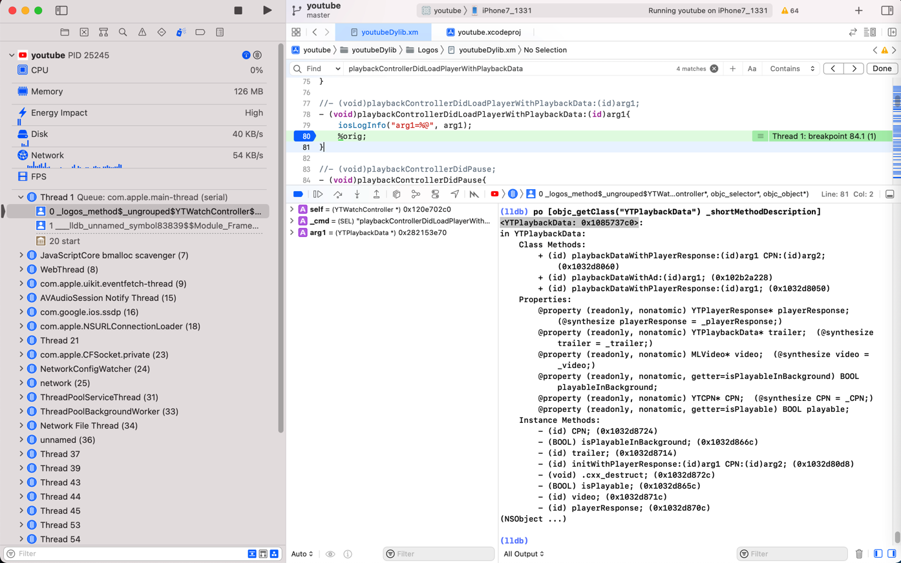
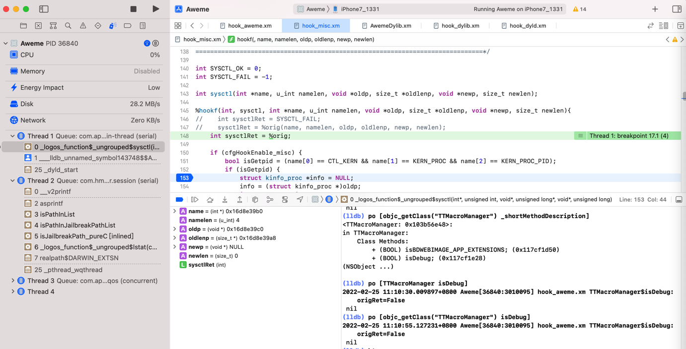
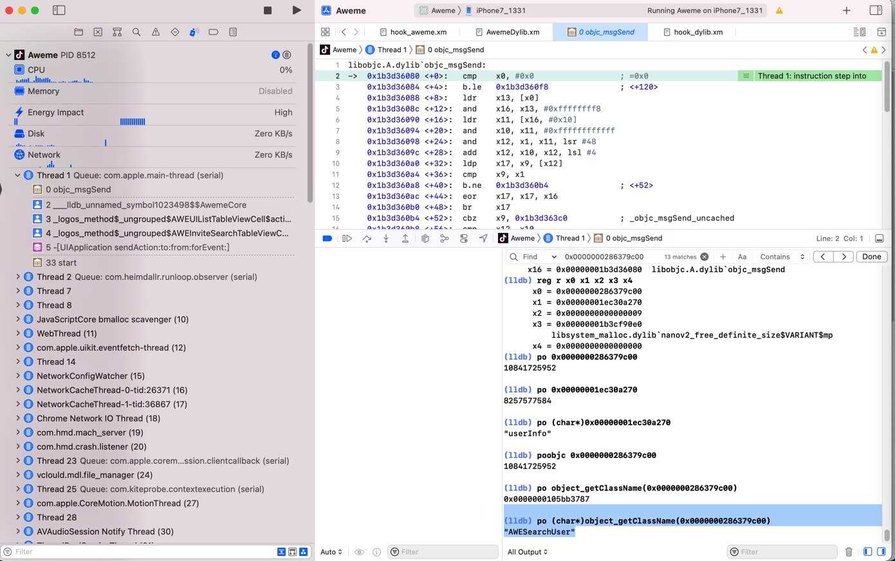
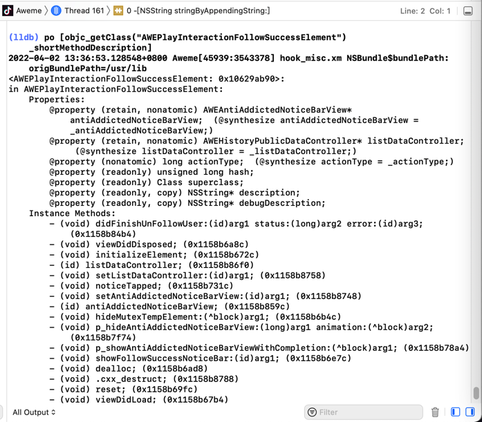
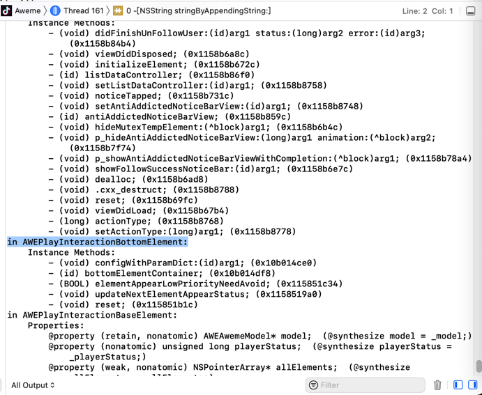

# po

TODO：

* po失效
  * 【无需解决】Xcode中lldb调试iOS的ObjC的汇编代码时：偶尔po失效打印不出变量类型
  * 【未解决】Xcode中lldb的po再次失效尝试搞懂内部原因

---

[LLDB中的调试命令po](http://book.crifan.org/books/xcode_debugger_lldb/website/lldb_commands/common_cmd/expression/po.html)，也是iOS逆向期间，用的最多的命令：用于查看某个地址，具体是什么（iOS的ObjC的）类。

对于`po`，也有很多经验和心得，整理如下。


## 类Class 对比 实例Instance

折腾：

【记录】XCode+MonkeyDev动态调试YouTube类：YTWatchMiniBarViewController

期间，可以通过hook代码：

```c
%hook YTWatchController

//- (void)playbackControllerDidLoadPlayerWithPlaybackData:(id)arg1;
- (void)playbackControllerDidLoadPlayerWithPlaybackData:(id)arg1{
  iosLogInfo("arg1=%@", arg1);
  %orig;
}

%end
```

而输出log：

```c
2022-03-27 17:16:50.049397+0800 YouTube[25245:2617390] hook_ youtubeDylib.xm YTWatchController$playbackControllerDidLoadPlayerWithPlaybackData$: arg1=<YTPlaybackData: 0x282153e70>
```

而另外可以通过`po`查看到类`YTPlaybackData`的信息

```c
(lldb) po [objc_getClass("YTPlaybackData") _shortMethodDescription]
<YTPlaybackData: 0x1085737c0>:
in YTPlaybackData:
   Class Methods:
     + (id) playbackDataWithPlayerResponse:(id)arg1 CPN:(id)arg2; (0x1032d8060)
     + (id) playbackDataWithAd:(id)arg1; (0x102b2a228)
     + (id) playbackDataWithPlayerResponse:(id)arg1; (0x1032d8050)
   Properties:
     @property (readonly, nonatomic) YTPlayerResponse* playerResponse; (@synthesize playerResponse = _playerResponse;)
     @property (readonly, nonatomic) YTPlaybackData* trailer; (@synthesize trailer = _trailer;)
     @property (readonly, nonatomic) MLVideo* video; (@synthesize video = _video;)
     @property (readonly, nonatomic, getter=isPlayableInBackground) BOOL playableInBackground;
     @property (readonly, nonatomic) YTCPN* CPN; (@synthesize CPN = _CPN;)
     @property (readonly, nonatomic, getter=isPlayable) BOOL playable;
   Instance Methods:
     - (id) CPN; (0x1032d8724)
     - (BOOL) isPlayableInBackground; (0x1032d866c)
     - (id) trailer; (0x1032d8714)
     - (id) initWithPlayerResponse:(id)arg1 CPN:(id)arg2; (0x1032d80d8)
     - (void) .cxx_destruct; (0x1032d872c)
     - (BOOL) isPlayable; (0x1032d865c)
     - (id) video; (0x1032d871c)
     - (id) playerResponse; (0x1032d870c)
(NSObject ...)
```



两者对比：

* `Class`=`类`
  * 无需遇到对应类的变量，任何时候，只要代码加载到内存了，即可查看具体的内容
  * 查看类的信息的方式：
    ```c
    po [objc_getClass("YTPlaybackData") _shortMethodDescription]
    ```
  * 场景举例
    * 比如给`YouTube`加了断点`UIApplicationMain`，断点生效时，即可查看类`YTPlaybackData`的信息，而无需实际调试找到`YTPlaybackData`的实例变量
* `Instance`=`实例`
  * 只有遇到对应的变量类型了，才能看到具体的值
    * 比如，此处是运行到函数playbackControllerDidLoadPlayerWithPlaybackData的内部，YTPlaybackData作为参数，所以才能看到具体的Instance实例的值
  * 查看示例变量值的方式
    * 举例
      ```c
      (lldb) po [(YTPlaybackData* )0x282153e70 isPlayable]
      true

      (lldb) po [(YTPlaybackData* )0x282153e70 isPlayableInBackground]
      false

      (lldb) po [(YTPlaybackData* )0x282153e70 video]
      <MLVideo: 0x282149da0>

      (lldb) po [(YTPlaybackData* )0x282153e70 trailer]
      nil
      ```
      * 即可看到，当前类`YTPlaybackData`的实例：`<YTPlaybackData: 0x282153e70>`的各种属性值

### 用po打印Class类的属性Property或函数Method

* 打印Class的属性或函数值
  ```c
  po [ClassName classMethodOrProperty]
  ```
* 打印Class的Instance的属性或函数之
  ```c
  po [objc_getClass("ClassName") instanceMethodOrProperty]
  ```

举例：

```c
(lldb) po [objc_getClass("TTMacroManager") _shortMethodDescription]
<TTMacroManager: 0x103b56e48>:
in TTMacroManager:
     Class Methods:
         + (BOOL) isBDWEBIMAGE_APP_EXTENSIONS; (0x117cf1d50)
         + (BOOL) isDebug; (0x117cf1e28)
(NSObject ...)
```

进一步的，对应着（导出抖音的）头文件：

```c
#import <objc/NSObject.h>

@interface TTMacroManager : NSObject
{
}

+ (_Bool)isBDWEBIMAGE_APP_EXTENSIONS;
+ (_Bool)isDebug;

@end
```

想要查看当前的Class的值，则是：

```c
(lldb) po [TTMacroManager isDebug]
2022-02-25 11:10:30.009897+0800 Aweme[36840:3010095] hook_aweme.xm TTMacroManager$isDebug: origRet=False
 nil
```

注：此处输出的是被我加了hook了的代码的log

如果想要查看实例instance的值，则是：

```c
(lldb) po [objc_getClass("TTMacroManager") isDebug]
2022-02-25 11:10:55.127231+0800 Aweme[36840:3010095] hook_aweme.xm TTMacroManager$isDebug: origRet=False
 nil
```



## `po`失效时换用`object_getClassName`查看是什么类

iOS逆向期间，正常的话，`po`是可以打印出某个地址，具体是什么（ObjC的）类

比如：

```c
(lldb) po 0x0000000137419800
<AWEInviteSearchTableViewCell: 0x137419800; baseClass = UITableViewCell; frame = (0 152; 375 76); autoresize = W; layer = <CALayer: 0x28f694b00>>
```

-> 从而通过调试搞懂代码的具体逻辑：调用了什么(ObjC的)类的什么函数。

而有时候，不知何故，`po`失效，则打印不出来是什么类：

```c
(lldb) po 0x0000000286379c00
10841725952
```

此时，可以换用：`object_getClassName`

```c
(lldb) po (char*)object_getClassName(0x0000000286379c00)
"AWESearchUser"
```



## po查看类的描述的同时可以看到父类的相关定义

比如抖音的：

`Aweme_classDump/Aweme_17.8.0_header/Aweme/AWEPlayInteractionFollowSuccessElement.h`

```c
#import "AWEPlayInteractionBottomElement.h"

#import "AWEUserMessage-Protocol.h"

@class AWEAntiAddictedNoticeBarView, AWEHistoryPublicDataController, NSString;

@interface AWEPlayInteractionFollowSuccessElement : AWEPlayInteractionBottomElement <AWEUserMessage>
{
    AWEAntiAddictedNoticeBarView *_antiAddictedNoticeBarView;
    AWEHistoryPublicDataController *_listDataController;
    long long _actionType;
}

- (void).cxx_destruct;
@property(nonatomic) long long actionType; // @synthesize actionType=_actionType;
@property(retain, nonatomic) AWEHistoryPublicDataController *listDataController; // @synthesize listDataController=_listDataController;
@property(retain, nonatomic) AWEAntiAddictedNoticeBarView *antiAddictedNoticeBarView; // @synthesize antiAddictedNoticeBarView=_antiAddictedNoticeBarView;
- (void)didFinishUnFollowUser:(id)arg1 status:(long long)arg2 error:(id)arg3;
- (void)p_hideAntiAddictedNoticeBarView:(long long)arg1 animation:(CDUnknownBlockType)arg2;
- (void)p_showAntiAddictedNoticeBarViewWithCompletion:(CDUnknownBlockType)arg1;
- (void)noticeTapped;
- (void)showFollowSuccessNoticeBar:(id)arg1;
- (void)hideMutexTempElement:(CDUnknownBlockType)arg1;
- (void)dealloc;
- (void)viewDidDisposed;
- (void)reset;
- (void)viewDidLoad;
- (void)initializeElement;

// Remaining properties
@property(readonly, copy) NSString *debugDescription;
@property(readonly, copy) NSString *description;
@property(readonly) unsigned long long hash;
@property(readonly) Class superclass;

@end
```

去Xcode的lldb中动态调试抖音期间，通过：

```c
po [objc_getClass("AWEPlayInteractionFollowSuccessElement") _shortMethodDescription]
```

* 不仅能看到：类`AWEPlayInteractionFollowSuccessElement`本身的信息
* 还能看到：父类`AWEPlayInteractionBottomElement`
  * 父类的父类：`AWEPlayInteractionBottomElement`
    * 父类的父类的父类：`AWEPlayInteractionBaseElement`
      * 父类的父类的父类的父类：`AWEBaseElement`
        * 直到最后的根对象：`NSObject`

具体输出内容是：

```c
(lldb) po [objc_getClass("AWEPlayInteractionFollowSuccessElement") _shortMethodDescription]
2022-04-02 13:36:53.128548+0800 Aweme[45939:3543378] hook_misc.xm NSBundle$bundlePath: origBundlePath=/usr/lib
<AWEPlayInteractionFollowSuccessElement: 0x10629ab90>:
in AWEPlayInteractionFollowSuccessElement:
    Properties:
        @property (retain, nonatomic) AWEAntiAddictedNoticeBarView* antiAddictedNoticeBarView;  (@synthesize antiAddictedNoticeBarView = _antiAddictedNoticeBarView;)
        @property (retain, nonatomic) AWEHistoryPublicDataController* listDataController;  (@synthesize listDataController = _listDataController;)
        @property (nonatomic) long actionType;  (@synthesize actionType = _actionType;)
        @property (readonly) unsigned long hash;
        @property (readonly) Class superclass;
        @property (readonly, copy) NSString* description;
        @property (readonly, copy) NSString* debugDescription;
    Instance Methods:
        - (void) didFinishUnFollowUser:(id)arg1 status:(long)arg2 error:(id)arg3; (0x1158b84b4)
        - (void) viewDidDisposed; (0x1158b6a8c)
        - (void) initializeElement; (0x1158b672c)
        - (id) listDataController; (0x1158b86f0)
        - (void) setListDataController:(id)arg1; (0x1158b8758)
        - (void) noticeTapped; (0x1158b731c)
        - (void) setAntiAddictedNoticeBarView:(id)arg1; (0x1158b8748)
        - (id) antiAddictedNoticeBarView; (0x1158b859c)
        - (void) hideMutexTempElement:(^block)arg1; (0x1158b6b4c)
        - (void) p_hideAntiAddictedNoticeBarView:(long)arg1 animation:(^block)arg2; (0x1158b7f74)
        - (void) p_showAntiAddictedNoticeBarViewWithCompletion:(^block)arg1; (0x1158b78a4)
        - (void) showFollowSuccessNoticeBar:(id)arg1; (0x1158b6e7c)
        - (void) dealloc; (0x1158b6ad8)
        - (void) .cxx_destruct; (0x1158b8788)
        - (void) reset; (0x1158b69fc)
        - (void) viewDidLoad; (0x1158b67b4)
        - (long) actionType; (0x1158b8768)
        - (void) setActionType:(long)arg1; (0x1158b8778)
in AWEPlayInteractionBottomElement:
    Instance Methods:
        - (void) configWithParamDict:(id)arg1; (0x10b014ce0)
        - (id) bottomElementContainer; (0x10b014df8)
        - (BOOL) elementAppearLowPriorityNeedAvoid; (0x115851c34)
        - (void) updateNextElementAppearStatus; (0x1158519a0)
        - (void) reset; (0x115851b1c)
in AWEPlayInteractionBaseElement:
    Properties:
        @property (retain, nonatomic) AWEAwemeModel* model;  (@synthesize model = _model;)
        @property (nonatomic) unsigned long playerStatus;  (@synthesize playerStatus = _playerStatus;)
        @property (weak, nonatomic) NSPointerArray* allElements;  (@synthesize allElements = _allElements;)
        @property (readonly) unsigned long hash;
        @property (readonly) Class superclass;
        @property (readonly, copy) NSString* description;
        @property (readonly, copy) NSString* debugDescription;
    Instance Methods:
        - (struct CGRect) viewFrame; (0x11584af68)
        - (void) videoDidActivity; (0x10b0937f8)
        - (BOOL) alertIfNotValidForAction:(long)arg1; (0x11584aae8)
        - (id) elementFromAll:(id)arg1; (0x10b043ad8)
        - (void) viewController_viewWillDisappear; (0x11584abc4)
        - (void) viewController_viewDidDisappear; (0x11584abc8)
        - (void) viewController_didEndDisplaying; (0x11584abcc)
        - (void) viewController_willDisplay; (0x11584abb4)
        - (void) viewController_viewWillAppear; (0x11584abbc)
        - (void) viewController_viewDidAppear; (0x11584abc0)
        - (void) hideAllElementExcepts:(id)arg1; (0x11584a90c)
        - (void) updateAllElement; (0x11584ab74)
        - (void) setAllElements:(id)arg1; (0x10b019980)
        - (id) currentInfoForUnitWithIdentifier:(id)arg1; (0x11584aed8)
        - (void) hideProgressSliderPopView; (0x11584ac74)
        - (id) currentInfoForSubUnits; (0x11584adcc)
        - (id) currentInfoForUnitWithClassName:(id)arg1; (0x11584ae5c)
        - (void) dealloc; (0x11584abe4)
        - (void) .cxx_destruct; (0x11584b090)
        - (void) pause; (0x11584ac54)
        - (void) resume; (0x11584ac64)
        - (void) setData:(id)arg1; (0x10b04aecc)
        - (id) context; (0x10b00ef84)
        - (void) reset; (0x11584abd0)
        - (id) model; (0x10b016d44)
        - (void) setModel:(id)arg1; (0x10b01cf58)
        - (void) play; (0x11584abe0)
        - (void) prepareForDisplay; (0x10b06b068)
        - (BOOL) isShowing; (0x11584b074)
        - (void) didEndDisplaying; (0x11584abb8)
        - (id) currentInfo; (0x11584acc0)
        - (unsigned long) playerStatus; (0x11584b080)
        - (void) setHide:(BOOL)arg1; (0x10b0899c0)
        - (void) setPlayerStatus:(unsigned long)arg1; (0x10b0431dc)
        - (id) allElements; (0x10b043c60)
in AWEBaseElement:
    Properties:
        @property (weak, nonatomic) AWEElementContainer* elementContainer;  (@dynamic elementContainer;)
        @property (weak, nonatomic) UIView* boxView;  (@synthesize boxView = _boxView;)
        @property (weak, nonatomic) UIView* elementView;  (@synthesize elementView = _elementView;)
        @property (nonatomic) BOOL hasCreateView;  (@synthesize hasCreateView = _hasCreateView;)
        @property (retain, nonatomic) AWEPageContext* context;  (@synthesize context = _context;)
        @property (weak, nonatomic) AWEElementContainer* elementContainer;  (@synthesize elementContainer = _elementContainer;)
        @property (retain, nonatomic) UIView* view;  (@synthesize view = _view;)
        @property (retain, nonatomic) id data;  (@synthesize data = _data;)
        @property (readonly, nonatomic, getter=isViewLoaded) BOOL viewLoaded;
        @property (copy, nonatomic) NSString* identity;  (@synthesize identity = _identity;)
        @property (nonatomic) BOOL appear;  (@synthesize appear = _appear;)
        @property (readonly, weak, nonatomic) UIViewController* viewController;  (@synthesize viewController = _viewController;)
        @property (readonly) unsigned long hash;
        @property (readonly) Class superclass;
        @property (readonly, copy) NSString* description;
        @property (readonly, copy) NSString* debugDescription;
    Instance Methods:
        - (void) configWithParamDict:(id)arg1; (0x11232b734)
        - (void) viewDidDisposed; (0x11232b730)
        - (void) processAppear:(BOOL)arg1; (0x10b010138)
        - (id) elementContainer; (0x10b01036c)
        - (void) setAppear:(BOOL)arg1; (0x10b01d350)
        - (void) initializeElement; (0x10b00f048)
        - (void) setElementContainer:(id)arg1; (0x10b00ed6c)
        - (id) boxView; (0x11232b8fc)
        - (void) setBoxView:(id)arg1; (0x11232b914)
        - (id) elementView; (0x11232b920)
        - (void) setElementView:(id)arg1; (0x11232b938)
        - (BOOL) hasCreateView; (0x11232b944)
        - (void) setHasCreateView:(BOOL)arg1; (0x11232b94c)
        - (void) addSubviewWithLayout:(id)arg1 withEdgeInsets:(struct UIEdgeInsets)arg2; (0x11232b9ec)
        - (void) addSubviewWithLayout:(id)arg1 withEdgeInsets:(struct UIEdgeInsets)arg2 withHeight:(double)arg3; (0x11232b9fc)
        - (void) hide:(BOOL)arg1 duration:(double)arg2 animations:(^block)arg3; (0x11232bcc4)
        - (void) hide:(BOOL)arg1 duration:(double)arg2 withTransform:(struct CGAffineTransform)arg3 animations:(^block)arg4; (0x11232bd48)
        - (void) addSubviewWithLayout:(id)arg1; (0x11232b9d0)
        - (void) hide:(BOOL)arg1 duration:(double)arg2; (0x11232bcb4)
        - (void) .cxx_destruct; (0x11232b968)
        - (id) data; (0x11232b8e8)
        - (void) setData:(id)arg1; (0x11232b6cc)
        - (id) context; (0x11232b954)
        - (id) identity; (0x11232b8f0)
        - (void) setContext:(id)arg1; (0x11232b95c)
        - (void) setIdentity:(id)arg1; (0x10b014df0)
        - (id) view; (0x10b0101fc)
        - (void) setView:(id)arg1; (0x11232b8dc)
        - (void) loadView; (0x10b0102e0)
        - (void) viewDidLoad; (0x11232b72c)
        - (BOOL) isViewLoaded; (0x10b0101ec)
        - (id) viewController; (0x10b012c08)
        - (BOOL) appear; (0x10b00f010)
(NSObject ...)
```




