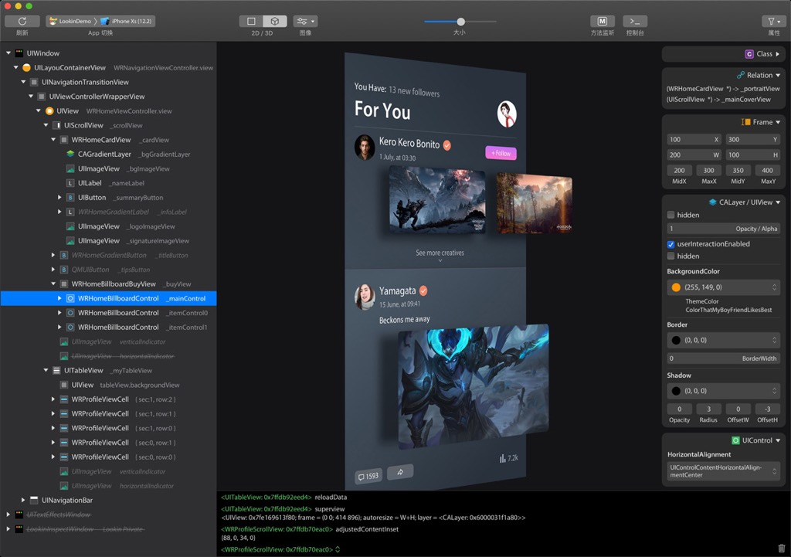

# 调试界面元素

TODO：

* 【整理】页面元素调试结果对比：Reveal、Cycript、LLDBTools、chisel
* 【记录】XCode+MonkeyDev动态调试抖音：从点赞关注UI界面入手找底层代码逻辑

---

iOS逆向的动态调试，也常会，从app的界面入手找对应的按钮等元素，此时就会涉及到：调试界面元素

常用的iOS的app的界面调试工具：

* `Reveal`
* `Cycript`
* （MonkeyDev的）`LLDBTools`
* `chisel`
* `FLEX`
* 其他
  * LookinLoader
    * https://github.com/creantan/LookinLoader
      * 
