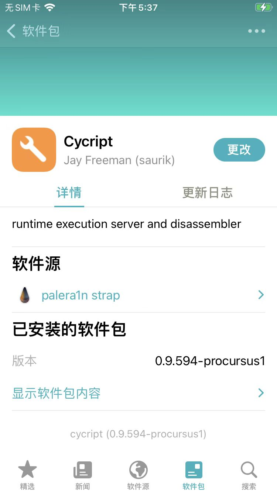
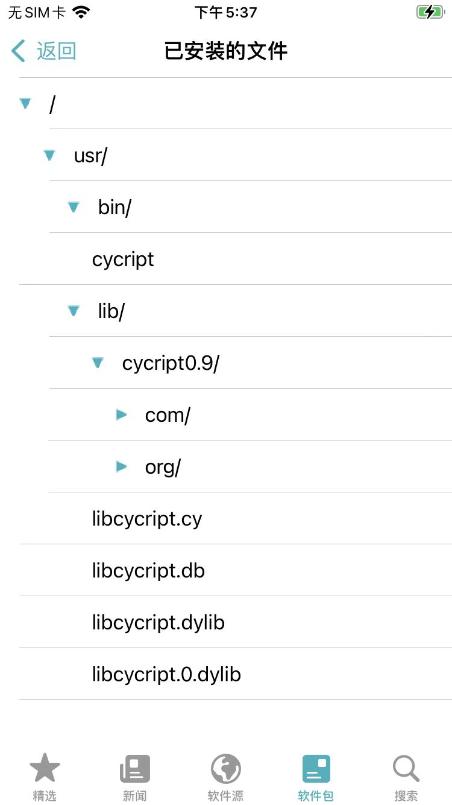
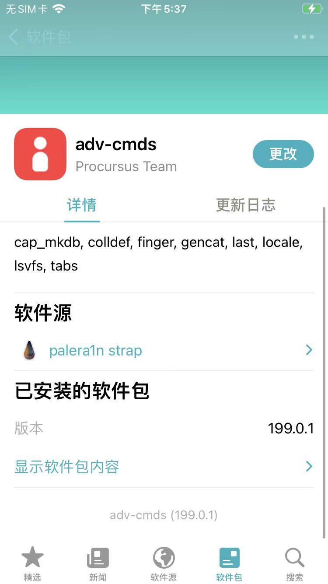
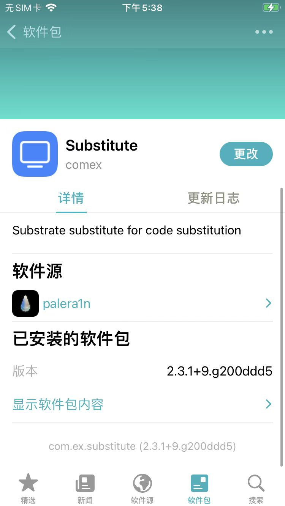
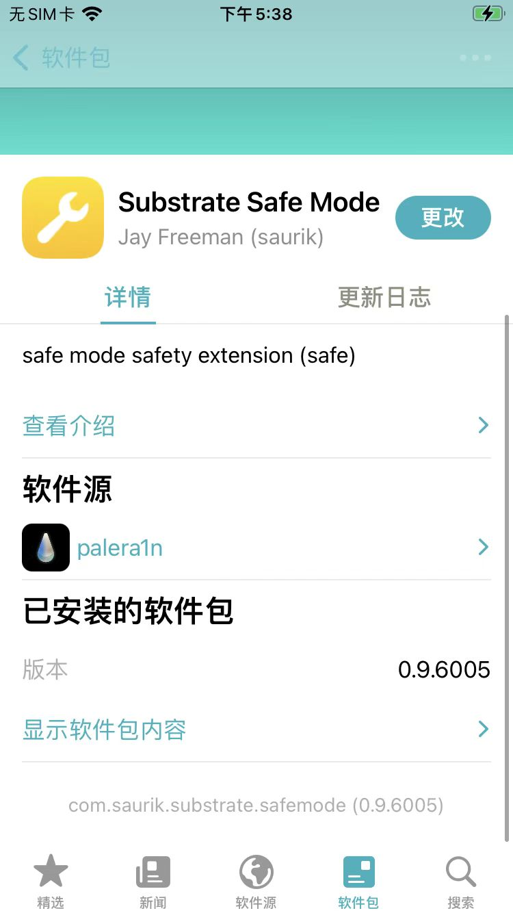

# Cycript初始化环境

* Cycript环境搭建=初始化
  * `Sileo`/`Cydia`中安装`cycript`插件即可
    * 步骤
      * 如果没有，需要先添加软件源：
        * https://strap.palera.in/
      * 然后去搜索：`cycript`，并安装，即可
    * 效果
      * 
      * 
    * 说明
      * Sileo中安装cycript会自动找到并安装各种依赖
        * adv-cmds
          * 
        * Substitute
          * 
          * 桌面图标：Substitute
            * 
        * Substrate Safe Mode
          * 

## 安装Cycript后

可以找到对应二进制文件：

```bash
iPhone8-150:~ root# which cycript
/usr/bin/cycript
```

查看基本语法：

```bash
iPhone8-150:~ root# cycript --help
cycript: unrecognized option `--help'
usage: cycript [-c] [-p <pid|name>] [-r <host:port>] [<script> [<arg>...]]
```
