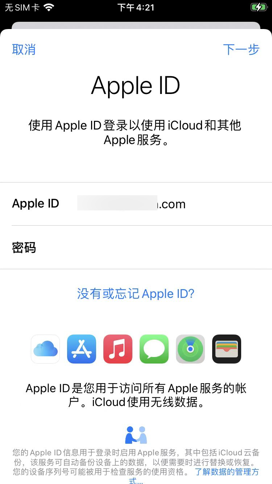

# Cycript使用心得

## 找按钮的响应函数=处理函数

* 背景

对于页面



中右上角的`下一步`按钮

想要去找，点击之后所触发的对应的处理函数

* 核心思路

* 主要过程和结论

先搞清楚下一步 按钮：

```bash
<UIButtonLabel: 0x107dacb10; frame = (0 1; 52 20.5); text = '下一步'; opaque = NO; userInteractionEnabled = NO; layer = <_UILabelLayer: 0x2823f0460>>
```

的上2级的元素：

```bash
<_UIButtonBarButton: 0x107d97600; frame = (0 0; 60 44); tintColor = <UIDynamicSystemColor: 0x2815a6dc0; name = systemBlueColor>; gestureRecognizers = <NSArray: 0x280fefdb0>; layer = <CALayer: 0x2801f8560>>
```

-》对应的：

```bash
cy# var nextStepBtn2 = #0x107d97600
#"<_UIButtonBarButton: 0x107d97600; frame = (0 0; 60 44); tintColor = <UIDynamicSystemColor: 0x2815a6dc0; name = systemBlueColor>; gestureRecognizers = <NSArray: 0x280fefdb0>; layer = <CALayer: 0x2801f8560>>"

cy# [nextStepBtn2 allTargets]
[NSSet setWithArray:@[#"<_UIButtonBar: 0x283fb7cf0> <_UIButtonBarStackView: 0x107da4c90; frame = (307 6; 60 44); layer = <CALayer: 0x2800665e0>> buttonBar=0x283fb7cf0\nmetrics=0x2815cacc0 layout=0x280f60270 groupLayouts=0x102b1aa70 views=0x280f9af70 guides=0x280f99bc0 activeConstraints=0x280f602d0 minimumInterItemSpace=8.000 minimumInterItemSpaceAnchor=0x2823c34d0 flexibleSpaceEqualSizeAnchor=0x2815c89c0 minimumInterGroupSpaceAnchor=0x2823c1270\nbarButtonGroups={\n<UIBarButtonItemGroup: 0x2823c3070> barButtonItems={\n\t<UIBarButtonItem: 0x107d75ef0> target=0x107d80750 action=_nextButtonSelected: title='\xe4\xb8\x8b\xe4\xb8\x80\xe6\xad\xa5'\n}\n} ",#"<_UIButtonBarTargetAction: 0x2801fbdc0>"]]]
```

中的：

* `_nextButtonSelected:`

## Cycript常见问题

### 偶尔卡死

现象：`cycript -p Preferences` 卡死

原因：偶尔的bug或者其他未知原因

解决办法：多试几次。

包括但不限于：

* 确保设置页面处于前台
* 多运行几次命令
* 打开设置页面，点击进入子页面再返回等等操作

就可以了。
