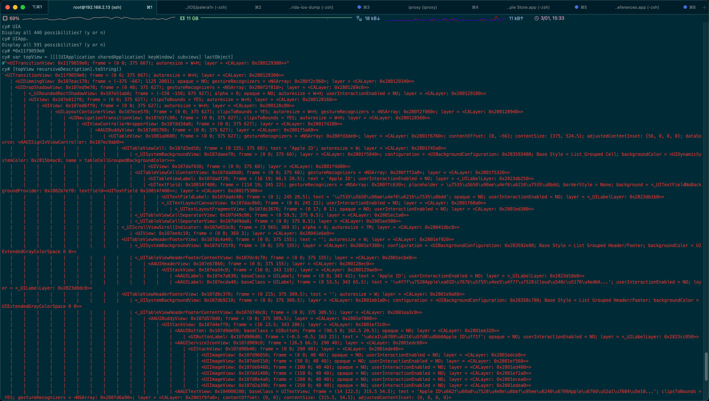
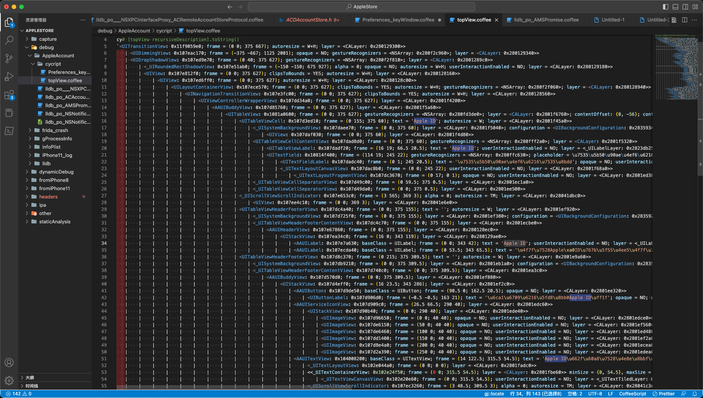

# Cycript输出举例

Cycript命令行输出的内容，尤其是对于页面详情，往往输出内容很多。

此处举例说明输出内容大概长什么样：

## Cycript输出效果举例

当前页面：


输出结果：

```bash
cy# var topView = [[[[UIApplication sharedApplication] keyWindow] subviews] lastObject]
#"<UITransitionView: 0x11f9059e0; frame = (0 0; 375 667); autoresize = W+H; layer = <CALayer: 0x280129300>>"

cy# [topView recursiveDescription].toString()
`<UITransitionView: 0x11f9059e0; frame = (0 0; 375 667); autoresize = W+H; layer = <CALayer: 0x280129300>>
   | <UIDimmingView: 0x107eac170; frame = (-375 -667; 1125 2001); opaque = NO; gestureRecognizers = <NSArray: 0x280f2c960>; layer = <CALayer: 0x280129340>>
   | <UIDropShadowView: 0x107ed9e70; frame = (0 40; 375 627); gestureRecognizers = <NSArray: 0x280f2f810>; layer = <CALayer: 0x2801289c0>>
   |    | <_UIRoundedRectShadowView: 0x107e51ab0; frame = (-150 -150; 675 927); alpha = 0; opaque = NO; autoresize = W+H; userInteractionEnabled = NO; layer = <CALayer: 0x280129180>>
   |    | <UIView: 0x107e812f0; frame = (0 0; 375 627); clipsToBounds = YES; autoresize = W+H; layer = <CALayer: 0x280128160>>
   |    |    | <UIView: 0x107ed6ff0; frame = (0 0; 375 627); autoresize = W+H; layer = <CALayer: 0x280128c00>>
   |    |    |    | <UILayoutContainerView: 0x107ece570; frame = (0 0; 375 627); clipsToBounds = YES; autoresize = W+H; gestureRecognizers = <NSArray: 0x280f2f060>; layer = <CALayer: 0x280128940>>
   |    |    |    |    | <UINavigationTransitionView: 0x107e3fc00; frame = (0 0; 375 627); clipsToBounds = YES; autoresize = W+H; layer = <CALayer: 0x280128560>>
   |    |    |    |    |    | <UIViewControllerWrapperView: 0x107dd34a0; frame = (0 0; 375 627); layer = <CALayer: 0x2801f4200>>
   |    |    |    |    |    |    | <AAUIBuddyView: 0x107d85760; frame = (0 0; 375 627); layer = <CALayer: 0x2801f5a60>>
   |    |    |    |    |    |    |    | <UITableView: 0x1081a0600; frame = (0 0; 375 627); gestureRecognizers = <NSArray: 0x280fd3de0>; layer = <CALayer: 0x2801f6760>; contentOffset: {0, -56}; contentSize: {375, 524.5}; adjustedContentInset: {56, 0, 0, 0}; dataSource: <AAUISignInViewController: 0x107ec9ab0>>
   |    |    |    |    |    |    |    |    | <UITableViewCell: 0x107d3ed10; frame = (0 155; 375 60); text = 'Apple ID'; autoresize = W; layer = <CALayer: 0x2801f45a0>>
   |    |    |    |    |    |    |    |    |    | <_UISystemBackgroundView: 0x107daee70; frame = (0 0; 375 60); layer = <CALayer: 0x2801f5040>; configuration = <UIBackgroundConfiguration: 0x283593480; Base Style = List Grouped Cell; backgroundColor = <UIDynamicSystemColor: 0x2815b4ac0; name = tableCellGroupedBackgroundColor>>>
   |    |    |    |    |    |    |    |    |    |    | <UIView: 0x107daf030; frame = (0 0; 375 60); layer = <CALayer: 0x2801f4d80>>
   |    |    |    |    |    |    |    |    |    | <UITableViewCellContentView: 0x107dad8d0; frame = (0 0; 375 60); gestureRecognizers = <NSArray: 0x280fff2a0>; layer = <CALayer: 0x2801f5320>>
   |    |    |    |    |    |    |    |    |    |    | <UITableViewLabel: 0x107dadf20; frame = (16 19; 66.5 20.5); text = 'Apple ID'; userInteractionEnabled = NO; layer = <_UILabelLayer: 0x2823db250>>
   |    |    |    |    |    |    |    |    |    |    | <UITextField: 0x10814f400; frame = (114 19; 245 22); gestureRecognizers = <NSArray: 0x280ffc630>; placeholder = \u7535\u5b50\u90ae\u4ef6\u6216\u7535\u8bdd; borderStyle = None; background = <_UITextFieldNoBackgroundProvider: 0x2802b7ef0: textfield=<UITextField 0x10814f400>>; layer = <CALayer: 0x2801f5300>>
   |    |    |    |    |    |    |    |    |    |    |    | <UITextFieldLabel: 0x107dadc40; frame = (0 1; 245 20.5); text = '\u7535\u5b50\u90ae\u4ef6\u6216\u7535\u8bdd'; opaque = NO; userInteractionEnabled = NO; layer = <_UILabelLayer: 0x2823db1b0>>
   |    |    |    |    |    |    |    |    |    |    |    | <_UITextLayoutCanvasView: 0x107dac8b0; frame = (0 0; 245 22); userInteractionEnabled = NO; layer = <CALayer: 0x2801f68a0>>
   |    |    |    |    |    |    |    |    |    |    |    |    | <_UITextLayoutFragmentView: 0x107dc3670; frame = (0 17; 0 1); opaque = NO; userInteractionEnabled = NO; layer = <CALayer: 0x2801ed380>>
   |    |    |    |    |    |    |    |    |    | <_UITableViewCellSeparatorView: 0x107d49c00; frame = (0 59.5; 375 0.5); layer = <CALayer: 0x2801ec1a0>>
   |    |    |    |    |    |    |    |    |    | <_UITableViewCellSeparatorView: 0x107d49da0; frame = (0 0; 375 0.5); layer = <CALayer: 0x2801ee500>>
   |    |    |    |    |    |    |    |    | <_UIScrollViewScrollIndicator: 0x107e653c0; frame = (3 565; 369 3); alpha = 0; autoresize = TM; layer = <CALayer: 0x28041dbc0>>
   |    |    |    |    |    |    |    |    |    | <UIView: 0x107ee4c10; frame = (0 0; 369 3); layer = <CALayer: 0x28041e6e0>>
   |    |    |    |    |    |    |    |    | <UITableViewHeaderFooterView: 0x107dc4a40; frame = (0 0; 375 155); text = ''; autoresize = W; layer = <CALayer: 0x2801ef920>>
   |    |    |    |    |    |    |    |    |    | <_UISystemBackgroundView: 0x107d725f0; frame = (0 0; 375 155); layer = <CALayer: 0x2801ef380>; configuration = <UIBackgroundConfiguration: 0x283592e80; Base Style = List Grouped Header/Footer; backgroundColor = UIExtendedGrayColorSpace 0 0>>
   |    |    |    |    |    |    |    |    |    | <_UITableViewHeaderFooterContentView: 0x107dc4c70; frame = (0 0; 375 155); layer = <CALayer: 0x2801ecbe0>>
   |    |    |    |    |    |    |    |    |    |    | <AAUIHeaderView: 0x107e67860; frame = (0 0; 375 155); layer = <CALayer: 0x280128ec0>>
   |    |    |    |    |    |    |    |    |    |    |    | <UIStackView: 0x107ea34c0; frame = (16 0; 343 119); layer = <CALayer: 0x280129ae0>>
   |    |    |    |    |    |    |    |    |    |    |    |    | <AAUILabel: 0x107e7a630; baseClass = UILabel; frame = (0 0; 343 42); text = 'Apple ID'; userInteractionEnabled = NO; layer = <_UILabelLayer: 0x2823d10e0>>
   |    |    |    |    |    |    |    |    |    |    |    |    | <AAUILabel: 0x107ecda40; baseClass = UILabel; frame = (0 53.5; 343 65.5); text = '\u4f7f\u7528Apple\xa0ID\u767b\u5f55\u4ee5\u4f7f\u7528iCloud\u548c\u5176\u4ed6A...'; userInteractionEnabled = NO; layer = <_UILabelLayer: 0x2823d0dc0>>
   |    |    |    |    |    |    |    |    | <UITableViewHeaderFooterView: 0x107d8c370; frame = (0 215; 375 309.5); text = ''; autoresize = W; layer = <CALayer: 0x2801e9a60>>
   |    |    |    |    |    |    |    |    |    | <_UISystemBackgroundView: 0x107db9210; frame = (0 0; 375 309.5); layer = <CALayer: 0x2801eb1a0>; configuration = <UIBackgroundConfiguration: 0x28358c780; Base Style = List Grouped Header/Footer; backgroundColor = UIExtendedGrayColorSpace 0 0>>
   |    |    |    |    |    |    |    |    |    | <_UITableViewHeaderFooterContentView: 0x107d740c0; frame = (0 0; 375 309.5); layer = <CALayer: 0x2801ea3c0>>
   |    |    |    |    |    |    |    |    |    |    | <AAUIBuddyView: 0x107d570d0; frame = (0 0; 375 309.5); layer = <CALayer: 0x2801ef880>>
   |    |    |    |    |    |    |    |    |    |    |    | <UIStackView: 0x107d4eff0; frame = (16 23.5; 343 286); layer = <CALayer: 0x2801ef2c0>>
   |    |    |    |    |    |    |    |    |    |    |    |    | <AAUIButton: 0x107d9de50; baseClass = UIButton; frame = (90.5 0; 162.5 20.5); opaque = NO; layer = <CALayer: 0x2801ee320>>
   |    |    |    |    |    |    |    |    |    |    |    |    |    | <UIButtonLabel: 0x107d906d0; frame = (-0.5 -0.5; 163 21); text = '\u6ca1\u6709\u6216\u5fd8\u8bb0Apple ID\uff1f'; opaque = NO; userInteractionEnabled = NO; layer = <_UILabelLayer: 0x2823cc050>>
   |    |    |    |    |    |    |    |    |    |    |    |    | <AAUIServiceIconView: 0x107d909c0; frame = (26.5 66.5; 290 40); layer = <CALayer: 0x2801edc60>>
   |    |    |    |    |    |    |    |    |    |    |    |    |    | <UIStackView: 0x107d90b40; frame = (0 0; 290 40); layer = <CALayer: 0x2801ede40>>
   |    |    |    |    |    |    |    |    |    |    |    |    |    |    | <UIImageView: 0x107d96650; frame = (0 0; 40 40); opaque = NO; userInteractionEnabled = NO; layer = <CALayer: 0x2801edce0>>
   |    |    |    |    |    |    |    |    |    |    |    |    |    |    | <UIImageView: 0x107de6150; frame = (50 0; 40 40); opaque = NO; userInteractionEnabled = NO; layer = <CALayer: 0x2801ef560>>
   |    |    |    |    |    |    |    |    |    |    |    |    |    |    | <UIImageView: 0x107de6460; frame = (100 0; 40 40); opaque = NO; userInteractionEnabled = NO; layer = <CALayer: 0x2801ed480>>
   |    |    |    |    |    |    |    |    |    |    |    |    |    |    | <UIImageView: 0x107dd1400; frame = (150 0; 40 40); opaque = NO; userInteractionEnabled = NO; layer = <CALayer: 0x2801ef2a0>>
   |    |    |    |    |    |    |    |    |    |    |    |    |    |    | <UIImageView: 0x107d8e4a0; frame = (200 0; 40 40); opaque = NO; userInteractionEnabled = NO; layer = <CALayer: 0x2801ecea0>>
   |    |    |    |    |    |    |    |    |    |    |    |    |    |    | <UIImageView: 0x107d2a390; frame = (250 0; 40 40); opaque = NO; userInteractionEnabled = NO; layer = <CALayer: 0x2801edea0>>
   |    |    |    |    |    |    |    |    |    |    |    |    | <AAUITextView: 0x104008200; baseClass = UITextView; frame = (14 122.5; 315.5 54.5); text = 'Apple ID\u662f\u60a8\u7528\u4e8e\u8bbf\u95ee\u6240\u6709Apple\u670d\u52a1\u7684\u5e10...'; clipsToBounds = YES; gestureRecognizers = <NSArray: 0x280fd6a90>; layer = <CALayer: 0x2801f9fa0>; contentOffset: {0, 0}; contentSize: {315.5, 54.5}; adjustedContentInset: {0, 0, 0, 0}>
   |    |    |    |    |    |    |    |    |    |    |    |    |    | <_UITextLayoutView: 0x102e044a0; frame = (0 0; 0 0); layer = <CALayer: 0x2801fadc0>>
   |    |    |    |    |    |    |    |    |    |    |    |    |    | <<_UITextContainerView: 0x102e24f50; frame = (0 0; 315.5 54.5); layer = <CALayer: 0x2801fbe60>> minSize = {0, 54.5}, maxSize = {315.5, 54.5}, textContainer = <NSTextContainer: 0x283188000 size = (315.500000,38.500000); widthTracksTextView = YES; heightTracksTextView = YES>; exclusionPaths = 0x1f78db500; lineBreakMode = 0>
   |    |    |    |    |    |    |    |    |    |    |    |    |    |    | <_UITextViewCanvasView: 0x102e20e60; frame = (0 0; 315.5 54.5); userInteractionEnabled = NO; layer = <_UITextTiledLayer: 0x2832ae7f0>>
   |    |    |    |    |    |    |    |    |    |    |    |    |    | <_UIScrollViewScrollIndicator: 0x107ec3260; frame = (3 48.5; 309.5 3); alpha = 0; autoresize = TM; layer = <CALayer: 0x28041c3e0>>
   |    |    |    |    |    |    |    |    |    |    |    |    |    |    | <UIView: 0x107eb14b0; frame = (0 0; 309.5 3); layer = <CALayer: 0x28041d5e0>>
   |    |    |    |    |    |    |    |    |    |    |    |    |    | <_UIScrollViewScrollIndicator: 0x107e518f0; frame = (309.5 3; 3 48.5); alpha = 0; autoresize = LM; layer = <CALayer: 0x28041d600>>
   |    |    |    |    |    |    |    |    |    |    |    |    |    |    | <UIView: 0x107ead220; frame = (0 0; 3 48.5); layer = <CALayer: 0x28041c2a0>>
   |    |    |    |    |    |    |    |    |    |    |    |    | <OBPrivacyLinkButton: 0x107d6a250; baseClass = UIButton; frame = (0 193; 343 93); opaque = NO; layer = <CALayer: 0x2801e8a60>>
   |    |    |    |    |    |    |    |    |    |    |    |    |    | <UIView: 0x107d6a550; frame = (0 0; 343 93); userInteractionEnabled = NO; layer = <CALayer: 0x2801ea7c0>>
   |    |    |    |    |    |    |    |    |    |    |    |    |    |    | <UITextView: 0x108214800; frame = (1 29.5; 341.5 63.5); text = '\u60a8\u7684Apple\xa0ID\u4fe1\u606f\u7528\u4e8e\u767b\u5f55\u65f6\u542f\u7528Apple\u670d...'; clipsToBounds = YES; userInteractionEnabled = NO; gestureRecognizers = <NSArray: 0x280fe3e40>; layer = <CALayer: 0x2801eaf60>; contentOffset: {0, 0}; contentSize: {341.5, 63.5}; adjustedContentInset: {0, 0, 0, 0}>
   |    |    |    |    |    |    |    |    |    |    |    |    |    |    |    | <_UITextLayoutView: 0x107d77150; frame = (0 0; 0 0); layer = <CALayer: 0x2801e8120>>
   |    |    |    |    |    |    |    |    |    |    |    |    |    |    |    | <<_UITextContainerView: 0x107d76da0; frame = (0 0; 341.5 63.5); layer = <CALayer: 0x2801e8160>> minSize = {0, 63.5}, maxSize = {341.5, 63.5}, textContainer = <NSTextContainer: 0x2831b3160 size = (341.500000,63.500000); widthTracksTextView = YES; heightTracksTextView = YES>; exclusionPaths = 0x1f78db500; lineBreakMode = 0>
   |    |    |    |    |    |    |    |    |    |    |    |    |    |    |    |    | <_UITextViewCanvasView: 0x107d76fb0; frame = (0 0; 341.5 63.5); userInteractionEnabled = NO; layer = <_UITextTiledLayer: 0x28328b840>>
   |    |    |    |    |    |    |    |    |    |    |    |    |    |    |    | <_UIScrollViewScrollIndicator: 0x11f9154a0; frame = (3 57.5; 335.5 3); alpha = 0; autoresize = TM; layer = <CALayer: 0x28041d740>>
   |    |    |    |    |    |    |    |    |    |    |    |    |    |    |    |    | <UIView: 0x107eafe80; frame = (0 0; 335.5 3); layer = <CALayer: 0x28041c080>>
   |    |    |    |    |    |    |    |    |    |    |    |    |    |    |    | <_UIScrollViewScrollIndicator: 0x107ed65a0; frame = (335.5 3; 3 57.5); alpha = 0; autoresize = LM; layer = <CALayer: 0x28041c420>>
   |    |    |    |    |    |    |    |    |    |    |    |    |    |    |    |    | <UIView: 0x107e9c4a0; frame = (0 0; 3 57.5); layer = <CALayer: 0x28041d900>>
   |    |    |    |    |    |    |    |    |    |    |    |    |    |    | <OBTintInheritingImageView: 0x107d77b30; baseClass = UIImageView; frame = (156.5 0; 30 24); opaque = NO; userInteractionEnabled = NO; tintColor = <UIDynamicSystemColor: 0x2815a6dc0; name = systemBlueColor>; layer = <CALayer: 0x2801eb9e0>>
   |    |    |    |    |    |    |    |    | <_UIScrollViewScrollIndicator: 0x107ec93b0; frame = (369 105.5; 3 462.5); alpha = 0; autoresize = LM; layer = <CALayer: 0x28041f0c0>>
   |    |    |    |    |    |    |    |    |    | <UIView: 0x107e1b0d0; frame = (0 0; 3 462.5); layer = <CALayer: 0x28041e5e0>>
   |    |    |    |    | <UINavigationBar: 0x107e957e0; frame = (0 0; 375 56); opaque = NO; autoresize = W; layer = <CALayer: 0x2801288e0>>
   |    |    |    |    |    | <_UIBarBackground: 0x107eadd90; frame = (0 0; 375 56); userInteractionEnabled = NO; layer = <CALayer: 0x2801288c0>>
   |    |    |    |    |    |    | <UIImageView: 0x107d99450; frame = (0 0; 375 56); alpha = 0; opaque = NO; userInteractionEnabled = NO; layer = <CALayer: 0x2801f4360>>
   |    |    |    |    |    |    | <_UIBarBackgroundShadowView: 0x11f908b20; frame = (0 56; 375 0); layer = <CALayer: 0x280129440>> clientRequestedContentView effect=none
   |    |    |    |    |    |    |    | <_UIBarBackgroundShadowContentImageView: 0x107eaa210; frame = (0 0; 375 0); alpha = 0; opaque = NO; autoresize = W+H; userInteractionEnabled = NO; layer = <CALayer: 0x280129100>>
   |    |    |    |    |    | <_UINavigationBarContentView: 0x107ed4fa0; frame = (0 0; 375 56); layer = <CALayer: 0x280128880>> layout=0x107e1a430
   |    |    |    |    |    |    | <_UIButtonBarStackView: 0x107df1d90; frame = (8 6; 46 44); layer = <CALayer: 0x2801f7520>> buttonBar=0x283fbc5a0
   |    |    |    |    |    |    |    | <_UIButtonBarButton: 0x107de7110; frame = (0 0; 46 44); tintColor = <UIDynamicSystemColor: 0x2815a6dc0; name = systemBlueColor>; gestureRecognizers = <NSArray: 0x280f2a3a0>; layer = <CALayer: 0x2801f4280>>
   |    |    |    |    |    |    |    |    | <_UIModernBarButton: 0x107ef1fd0; frame = (8 11; 38 21.5); opaque = NO; userInteractionEnabled = NO; layer = <CALayer: 0x280129b20>>
   |    |    |    |    |    |    |    |    |    | <UIButtonLabel: 0x107ed0070; frame = (0 1; 35 20.5); text = '\u53d6\u6d88'; opaque = NO; userInteractionEnabled = NO; layer = <_UILabelLayer: 0x2823d26c0>>
   |    |    |    |    |    |    | <_UIButtonBarStackView: 0x107dccc80; frame = (307 6; 60 44); layer = <CALayer: 0x2801f4440>> buttonBar=0x283fbc4b0
   |    |    |    |    |    |    |    | <_UIButtonBarButton: 0x107d2b8b0; frame = (0 0; 60 44); tintColor = <UIDynamicSystemColor: 0x2815a6dc0; name = systemBlueColor>; gestureRecognizers = <NSArray: 0x280fd3420>; layer = <CALayer: 0x2801f7280>>
   |    |    |    |    |    |    |    |    | <_UIModernBarButton: 0x107db1ef0; frame = (0 11; 52 21.5); opaque = NO; userInteractionEnabled = NO; layer = <CALayer: 0x2801f5f00>>
   |    |    |    |    |    |    |    |    |    | <UIButtonLabel: 0x107d37c60; frame = (0 1; 52 20.5); text = '\u4e0b\u4e00\u6b65'; opaque = NO; userInteractionEnabled = NO; layer = <_UILabelLayer: 0x2823d9f40>>
   |    |    |    |    |    | <UIView: 0x107e097a0; frame = (0 0; 0 0); userInteractionEnabled = NO; layer = <CALayer: 0x2801296e0>>`
cy#
```



拷贝到VSCode中的显示效果：


