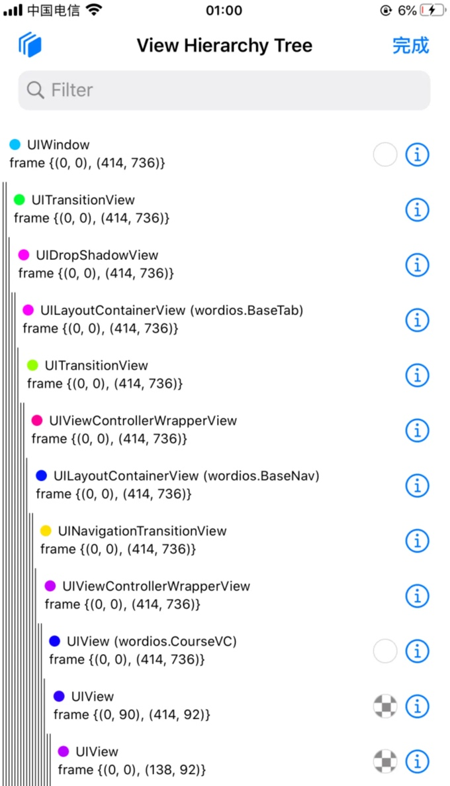
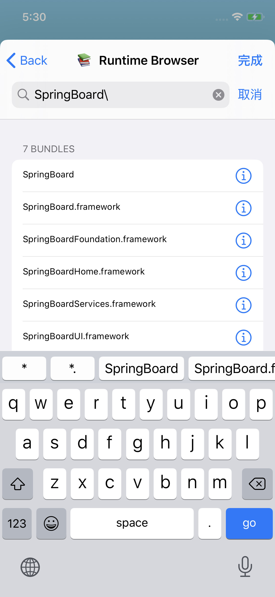
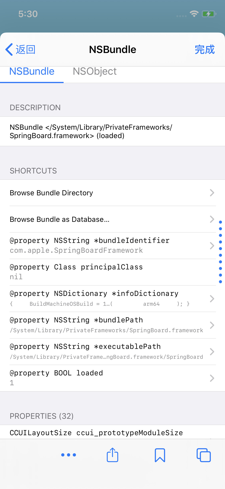

# FLEX

TODO：

【整理】iOS的iPhone越狱和改机相关知识

---

iOS越狱插件`FLEX`，可以用来辅助调试iOS的app的界面元素。

* `FLEX`
  * 效果
    * 当它加载时，会向目标程序上方添加一个悬浮的工具栏，通过这个工具栏可以查看和修改视图的层级结构、动态修改类的属性、动态调用实例和方法、动态查看类和框架以及动态修改UI等。
  * 截图
    * 
    * 
    * 好像还可以擦好看类的定义
      * 
      * 
