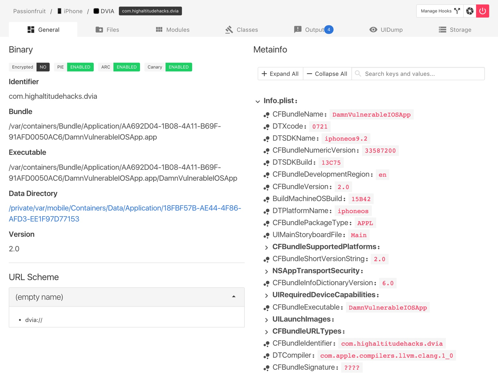

# Passionfruit

* `Passionfruit`
  * 概述：
    * `Passionfruit`通过`frida`注入代码到目标应用实现功能，再通过`node.js`服务端消息代理与浏览器通信，用户通过访问网页即可对App实现常规的检测任务
    * `Passionfruit`最大特点就是基于Web的**图形界面**，所以服务端支持跨平台的。
      * 在不少界面都添加了搜索功能，如模块列表、导出符号、`Objective-C`类，甚至`Plist`这样的序列化数据
  * 截图
    * 
  * Github
    * [chaitin/passionfruit: [WIP] Crappy iOS app analyzer](https://github.com/chaitin/passionfruit)
      * Simple iOS app blackbox assessment tool. Powered by frida.re and vuejs.
    * 注：2021年停止维护了
    * wiki
      * [Screenshots · chaitin/passionfruit Wiki (github.com)](https://github.com/chaitin/passionfruit/wiki/Screenshots)
