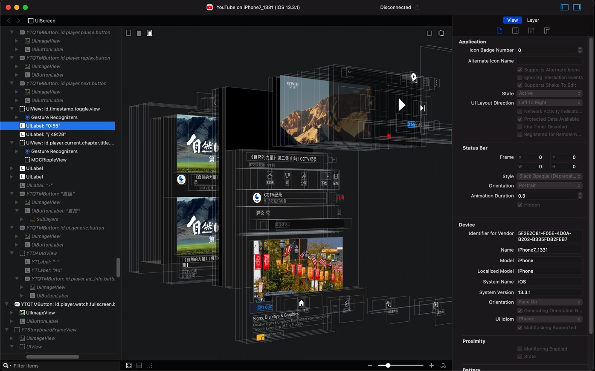
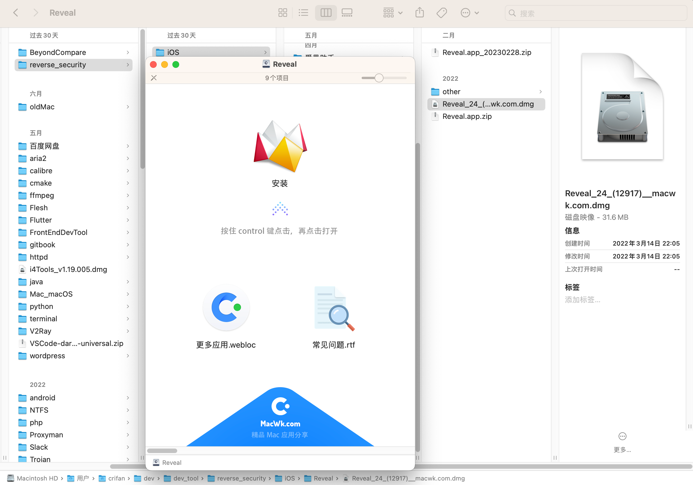
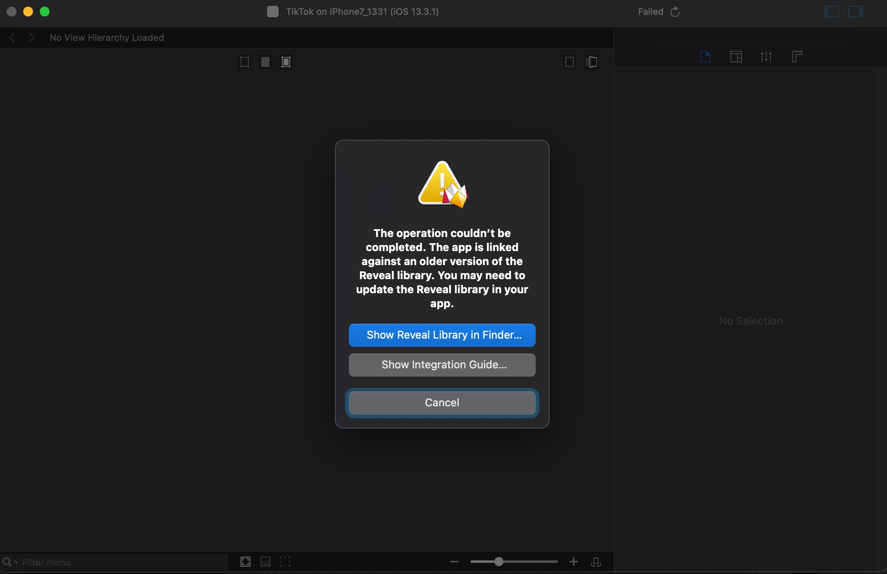
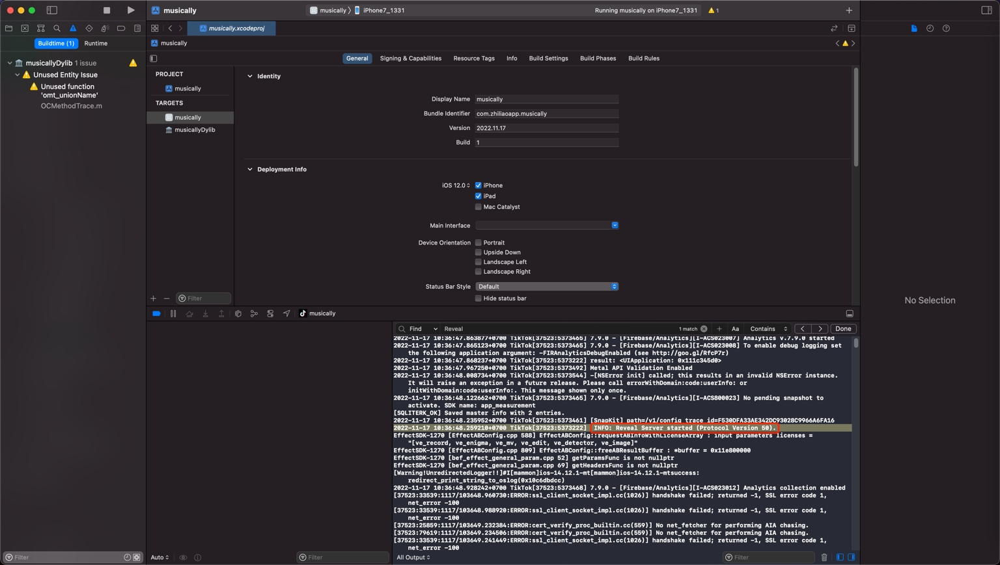
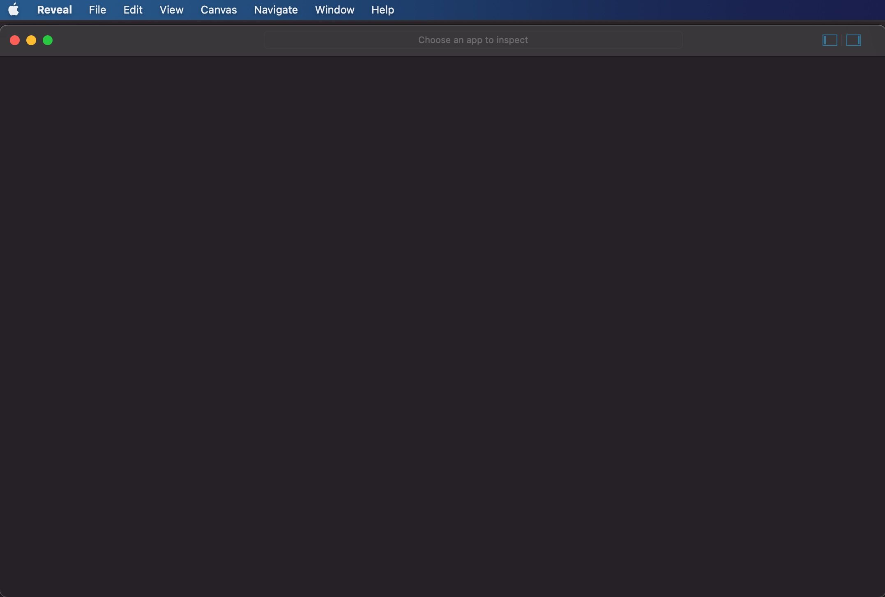
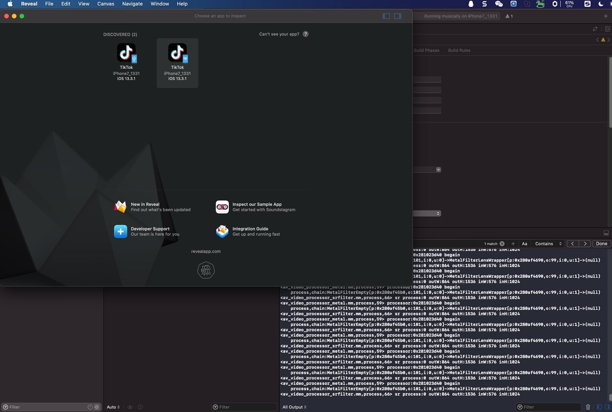
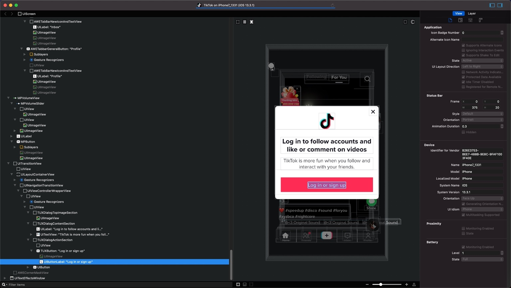
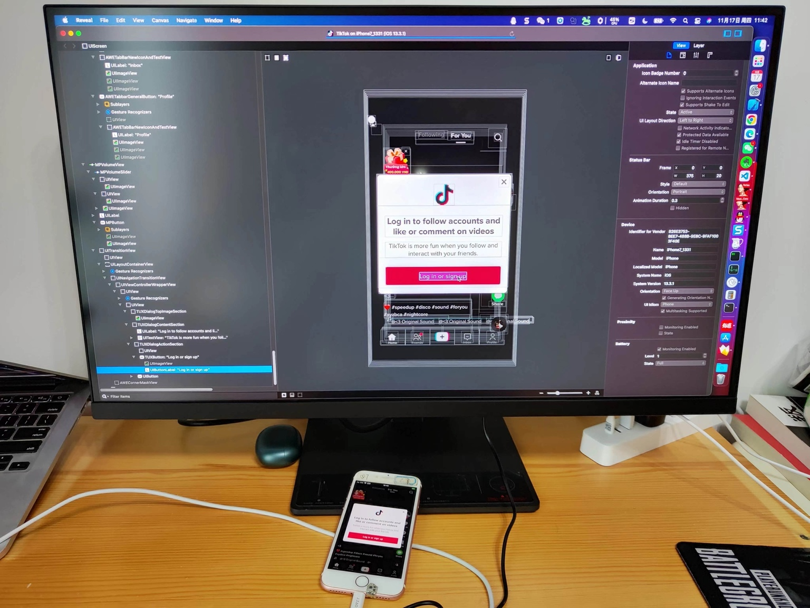
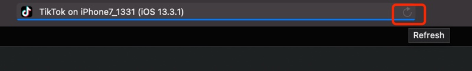

# Reveal

TODO：

* 【已解决】用Reveal查看抖音UI界面中点赞关注按钮相关的类和实现
* 【记录】找抖音关注按钮响应事件：pactions
* 【记录】通过Reveal查看页面元素找YouTube广告相关类
* 【记录】通过Reveal查看YouTube广告页面元素

---

iOS逆向中，用来调试界面元素，比较好用的工具之一就是：`Reveal`

* 效果举例
  * YouTube
    * 

## Xcode+MonkeyDev配合Reveal调试UI界面元素

### 下载安装Reveal

从网上下载到Reveal的dmg

注：https://www.macwk.com 网站2022年10月5日已关站，无法访问

然后安装：



### 确保`RevealServer.framework`版本一致

* `Mac`：`Reveal.app`中的`RevealServer.framework`
  * 默认位置：`/Users/{YourUserName}/Library/Application Support/Reveal/RevealServer/iOS/RevealServer.framework`
* `iPhone`：所运行的是`MonkeyDev`内部集成的`RevealServer.framework`
  * 默认位置：`/opt/MonkeyDev/Frameworks/RevealServer.framework`

要确保版本一致。

否则`Reveal.app`连接`iPhone`调试时会报错：

```bash
The operation couldn't be completed. The app is linked against an older version of the Reveal library. You may need to update the Reveal library in your
app.
```



解决办法：

点击弹框中的：`Show Reveal Library in Finder…`，会自动打开（当前`Mac`中）最新版本的`RevealServer.framework`

`/Users/{YourUserName}/Library/Application Support/Reveal/RevealServer/iOS/RevealServer.framework`

然后将其拷贝过去，替换掉旧的`MonkeyDev`的：

`/opt/MonkeyDev/Frameworks/RevealServer.framework`

即可。

注：

* `/opt/MonkeyDev/Frameworks/`
  * 是MonkeyDev的常见的默认的安装路径
* 复制时需要root权限
  * 所以命令行复制时，需要sudo，否则会报错没有权限
  * Finder界面中复制时，需要输入当前Mac用户的密码

### 用`XCode`+`MonkeyDev`调试`iOS`的`app`(`ipa`)

其中Xcode中能输出=能搜到对应的log：

```bash
2022-11-17 10:36:48.259210+0700 TikTok[37523:5373222]  INFO: Reveal Server started (Protocol Version 50).
```



表示Reveal Server服务已启动

注意：

* 确保最后一条Reveal的log是Started
  * -》意思是Reveal的确在运行
  * 否则也可能遇到，中间Reveal是Started，但之后还有Stopped的log，则表示Reveal服务是停止掉了
  * 那样的话，Reveal是无法使用的

### 打开Mac中的`Reveal.app`，去连接和调试设备中的app的界面

`Reveal`->`File`->`New Tab`

点击`Discovered`所显示出iPhone设备了

注意：

* 首次启动Reveal后，往往看不到iPhone设备（中的app）
  * 图
    * 
  * 解决办法：
    * 关闭Reveal，重启Reveal，即可。

一般正常会出现2个按钮：

* Wifi
* USB

按道理USB的连接更稳定些，所以一般点击USB的



即可连接和正常调试app的UI界面元素了：



Mac电脑+iPhone手机的效果：



#### 刷新页面

如果app端页面刷新了，可以点击Tab顶部的右上角的刷新按钮，即可刷新



注：

此处Refresh按钮是灰色的，原因是：此处Tiktok的app的UI界面元素内容太多，导致一直在加载，始终加载不能完全结束，所以无法刷新

不过一般无所谓，可以重新关掉窗口，重新点击连接设备，从而分析app上最新的界面元素的。
